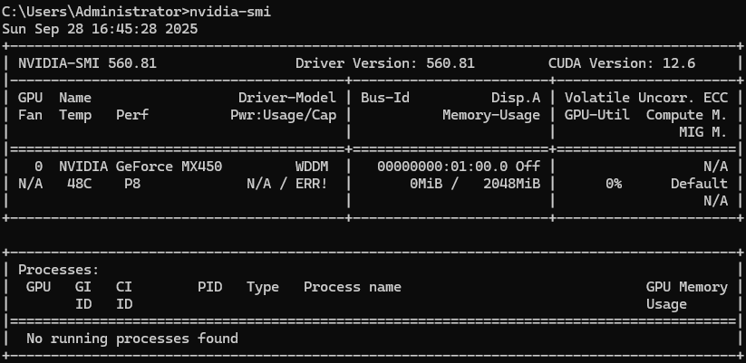
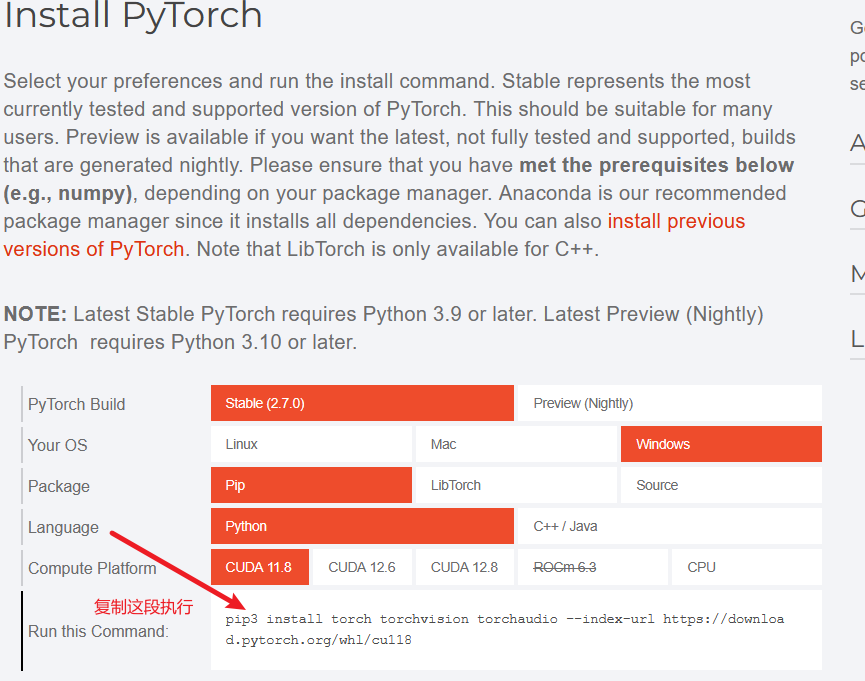

#0、py复习
    创建项目独立py环境
    python -m venv .venv

#1、什么是pytorch
    ##1、一个基于Numpy的科学计算包，提供两个主要功能：
        作为Numpy的替代者，向用户提供使用GPU的强大功能
        作为一款深度学习平台，向用户提供最大的灵活性和速度

#2、Pytorch的基本元素
    Tensors 张量， 类似于Numpy中的ndarray数据结构， Tensor可以使用GPU的加速功能

#3、Pytorch的安装
    ##1、根据显卡版本型号下载安装cuda
       （1）查看命令 cmd执行 nvidia-smi
         
       （2）cuda下载 https://developer.nvidia.com/cuda-toolkit
       （3）安装测试 cmd 执行 nvcc --version 显示cuda版本信息
    
    2、在vscode中安装 pytorch
        （1）pytorch 有cpu 和 gpu 两个版本
            cpu版本：直接运行 pip install torch， 没有pip先安装python
       （2）访问pytorch官网，根据电脑情况，选择对应版本，获取安装链接命令
            https://pytorch.org/
            
            测试：
                <code>
                import torch
                print(torch.__version__)
                if torch.cuda.is_available():
                    print("cuda is available")
                else:
                    print("cuda is not available")
                </code>